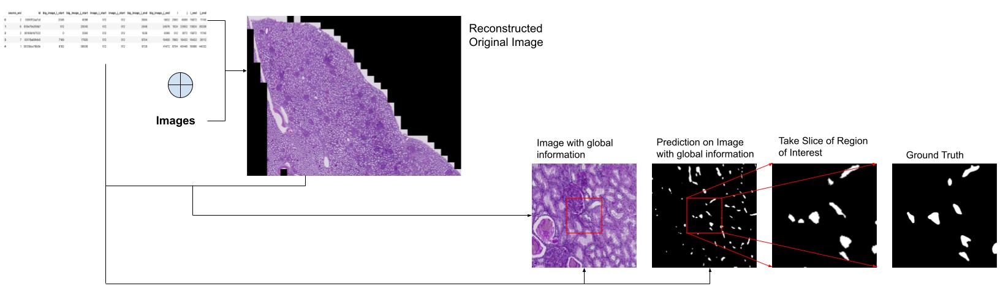

## Overview

Utilizing metadata comprising x and y coordinates, the provided samples were amalgamated to generate a `Reconstructed Original Image`. Each sample was processed to extract a contextual window of 512 units in both dimensions, unless proximity to the image boundary necessitated a larger contextual area on the opposite side. This resulting composition is denoted as the `Image with Global Information`.

A predictive model was subsequently employed to generate a segmentation mask for the `Image with Global Information`, henceforth termed as `Global Information Mask`. Further refinement was achieved by isolating the region of interest based on x and y coordinates in metadata, yielding the `Mask of Region of Interest`. This strategic integration of global information substantiates the precision of the predictive outcome.

The implementation also embraced advanced techniques such as test time augmentation and ensembling to enhance the model's performance, thereby exemplifying a comprehensive approach to refining predictive accuracy.
